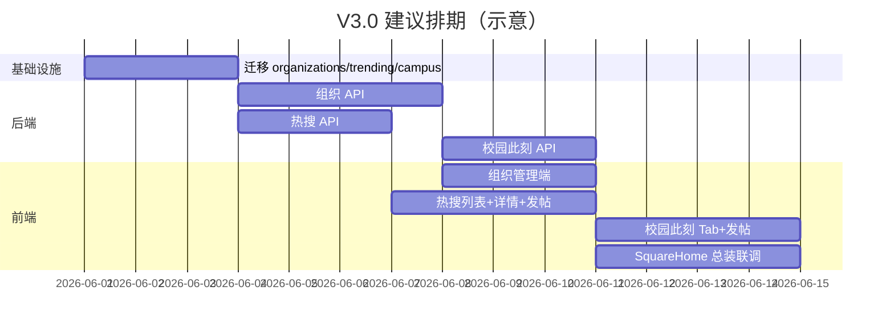

# 广场与组织系统开发计划（V3.0 → V3.1）

**依据设计文档：**

- `docs/02-设计文档/Dorm 广场模块设计文档（V3.0）.md`
- `docs/02-设计文档/Dorm 组织系统设计文档（V3.0）.md`

**项目：** Dorm · XMUMDorm-2.0.0-LYZZ  
**编写目的：** 将广场改版与组织体系拆解为可执行的前后端任务，明确与现有模块（社团、出物、帮帮我、一站通）的边界与复用关系。  
**核心定位：** 广场 = 校园动态聚合中心；组织 = 官方/学院身份表达（不新增用户角色枚举）。

---

## 0. 现状纵览（开发前必读）

### 0.1 已有能力（可复用）

| 能力 | 前端 | 后端 | 说明 |
|------|------|------|------|
| 广场 Tab 根页 | `AboutUs.jsx`（`/about`） | — | **地图贴图 + 贴纸入口**，非设计稿 V3.0 信息流结构 |
| 四宫格子模块（部分） | 贴纸跳转 | — | 社团 `/about/club`、一站通 `/about/freshman-guide`、帮帮我 `/about/errands`、出物 `/about/second-hand` |
| 社团广场 | `SquareClub`、`ClubProfile` 等 | `routes/clubs.js` | 社团主页/帖子/活动已较完整 |
| 马校一站通 | `SquareFreshmanGuide`、`Handbook*` | `routes/handbook.js` | 新生指南/文章/课评 |
| 帮帮我 | `SquareErrands`、`ErrandDetail` | `routes/errands.js` | 跑腿/求助 |
| 出物 | `SquareSecondHand`、`Marketplace*` | `routes/marketplace.js` | 二手交易 |
| 热搜入口 | `AboutUs` 贴纸 → `/about/trending` | — | **`SquareTrending.jsx` 仅占位页**（Coming soon） |
| 树洞帖子 | `TreeHole`、`PostNew`、`PostDetail` | `routes/posts.js` | `type`: `normal` / `announcement`；标签 `tags` + `post_tag_map` |
| 管理员公告 | `PostNew`（admin） | 全站通知 | 与「组织身份发帖」「热搜帖」**尚未区分** |
| 用户角色 | `AuthContext` | `users.role` | `student` / `merchant` / `admin`，**无组织表** |

### 0.2 设计目标与缺口

| 设计模块（V3.0） | 现状 | 缺口等级 |
|------------------|------|----------|
| 广场页结构（热搜 → 四宫格 → 校园此刻） | 地图贴图首页 | **高** — 需新建/重构 `AboutUs` 或 `SquareHome` |
| 热搜榜（运营配置 + 讨论区） | 占位页 | **高** — 新数据模型 + 列表/详情/发帖 API + UI |
| 热搜帖 vs 树洞帖隔离 | 共用 `posts` | **高** — 需 `channel` 或独立表，禁止与树洞混流 |
| 核心四宫格 | 贴纸跳转已有 | **低** — 改为卡片四宫格 UI，路由可复用 |
| 校园此刻（学校公告 / 学院通知 Tab） | 无 | **高** — 依赖组织系统 + 组织身份发帖 |
| 组织 Organization + Membership | 无 | **高** — 新表 + 管理端 CRUD |
| 管理员创建组织/加成员 | 无 | **高** — 管理 UI + 邮箱搜用户 |
| 成员以组织身份发帖 | 无 | **高** — 发帖入口、身份选择、流展示 |
| 顶部搜索（广场） | 设计标注可选 | **低（V3.0 可后置）** |

### 0.3 模块边界（避免 scope 膨胀）

| 内容 | 广场 V3.0 职责 | 归属模块 |
|------|------------------|----------|
| 社团内部通知/帖子详情 | 仅入口导流 | 社团 `clubs` |
| 出物/跑腿详情 | 仅入口 + 动态卡片跳转 | `marketplace` / `errands` |
| 学校工具/教务 | 仅入口 | `handbook` 一站通 |
| 热搜讨论帖 | 广场承载 | **新建 trending 域** |
| 学校部门/学院通知帖 | 校园此刻 Tab | **组织身份帖** + `organizations` |

### 0.4 建议路由规划

| 路径 | 组件（建议） | 说明 |
|------|----------------|------|
| `/about` | `SquareHome.jsx`（新，或重构 `AboutUs`） | **V3.0 广场主页面** |
| `/about/map` | `AboutUs.jsx`（可选保留） | 原地图贴图页作二级/彩蛋 |
| `/about/trending` | `SquareTrendingList.jsx`（新） | 热搜榜列表 |
| `/about/trending/:id` | `SquareTrendingDetail.jsx`（新） | 热搜讨论区 + 发帖 |
| `/about/trending/:id/new` | `SquareTrendingPostNew.jsx`（新） | 热搜下发帖（绑定 topic_id） |
| `/about/campus/new` | `SquareCampusPostNew.jsx`（新） | 校园此刻发帖（选组织身份） |
| `/about/admin/orgs` | `SquareOrgAdmin.jsx`（新） | 管理员：组织与成员（仅 admin） |
| 四宫格子路由 | 保持现有 | `club` / `freshman-guide` / `errands` / `second-hand` |

---

## 1. 目标页面结构（V3.0）

### 1.1 广场首页（自上而下）

```
顶部搜索（可选，V3.0 可仅占位）

↓

🔥 热搜榜（Top N，#1~#3 色阶）

↓

核心功能四宫格
  社团广场 | 马校一站通
  帮帮我   | 出物

↓

📢 校园此刻（Tab：学校公告 | 学院通知）
```

### 1.2 用户主路径

```
打开广场 → 看热搜 → 点四宫格/动态 → 进入子模块或讨论区 → 参与互动
```

### 1.3 组织系统与广场的关系

```
User ──Membership──► Organization
                           │
                           ▼
              以组织身份发帖 ──► 校园此刻对应 Tab
```

**角色不变：** 仍用 `Student` / `Merchant` / `Admin` 做权限；组织仅表达「发布身份」。

---

## 2. 数据模型草案（V3.0）

> 实施前可在 `docs/02-设计文档` 旁补 ER 图；下列为开发计划级字段约定。

### 2.1 组织 `organizations`

| 字段 | 类型 | 说明 |
|------|------|------|
| `id` | INT PK | |
| `type` | ENUM | `SchoolDepartment` / `College` / `Official` |
| `name` | VARCHAR | 组织名称 |
| `avatar` | VARCHAR | 头像 key 或 URL |
| `description` | TEXT | 简介 |
| `is_active` | TINYINT | 停用后不可选为发帖身份 |
| `created_at` / `updated_at` | TIMESTAMP | |

**说明：** 社团（Club）继续走 `clubs` 表，**不并入** `organizations`，避免与「社团广场」模块重复建设。

### 2.2 成员 `organization_memberships`

| 字段 | 类型 | 说明 |
|------|------|------|
| `id` | INT PK | |
| `organization_id` | INT FK | |
| `user_id` | INT FK | |
| `title` | VARCHAR | 职位，如「主管」「Advisor」 |
| `permission_level` | TINYINT | 预留：发帖/管理（V3.0 可简化为「能发帖=1」） |
| `created_at` | TIMESTAMP | |
| UNIQUE | `(organization_id, user_id)` | 同一组织不重复加入 |

### 2.3 热搜话题 `trending_topics`

| 字段 | 类型 | 说明 |
|------|------|------|
| `id` | INT PK | |
| `title` | VARCHAR | 热搜标题 |
| `description` | TEXT NULL | 可选说明 |
| `starts_at` / `ends_at` | TIMESTAMP NULL | 定时上下线 |
| `sort_order` | INT | 越小越靠前 |
| `is_active` | TINYINT | |
| `created_by` | INT | 管理员 user_id |

### 2.4 热搜帖子 `trending_posts`（与树洞隔离）

| 字段 | 类型 | 说明 |
|------|------|------|
| `id` | INT PK | |
| `topic_id` | INT FK | 绑定热搜 |
| `user_id` | INT FK | |
| `content` | TEXT | 正文（可复用 sanitize 规则） |
| `deleted_at` | TIMESTAMP NULL | 逻辑删除 |
| `hidden_by_admin` | TINYINT | |
| `created_at` | TIMESTAMP | |

**可选：** 热搜帖图片表 `trending_post_images`（若需与树洞一致的多图能力）。

**硬规则：** `trending_posts` **不得**写入 `posts` 表或在树洞列表出现；`posts` 亦不得通过 tag 冒充热搜讨论区。

### 2.5 校园此刻帖子 `campus_posts`（组织身份）

| 字段 | 类型 | 说明 |
|------|------|------|
| `id` | INT PK | |
| `organization_id` | INT FK | 发布身份组织 |
| `author_user_id` | INT FK | 实际操作人 |
| `feed_tab` | ENUM | `school`（学校公告）/ `college`（学院通知） |
| `title` | VARCHAR | |
| `content` | TEXT | |
| `deleted_at` / `hidden_by_admin` | | 与帖子系统一致 |
| `created_at` | TIMESTAMP | |

**Tab 与组织类型映射：**

| Tab | 允许的组织 `type` |
|-----|-------------------|
| 学校公告 `school` | `SchoolDepartment`、`Official` |
| 学院通知 `college` | `College` |

**发帖权限：** 用户须在 `organization_memberships` 中有对应组织记录；管理员代发可走 admin 接口。

---

## 3. V3.0 开发计划

> 组织系统为校园此刻的前置依赖；热搜可与四宫格并行。建议顺序见 **§3.8**。

---

### 3.1 模块 A：数据库迁移

| # | 任务 | 产出 | 依赖 |
|---|------|------|------|
| B-A1 | `migrations/041_organizations.sql` | `organizations` 表 | — |
| B-A2 | `migrations/042_organization_memberships.sql` | 成员表 + 唯一索引 | B-A1 |
| B-A3 | `migrations/043_trending_topics.sql` | 热搜话题表 | — |
| B-A4 | `migrations/044_trending_posts.sql` | 热搜帖子表 | B-A3 |
| B-A5 | `migrations/045_campus_posts.sql` | 校园此刻帖表 | B-A1 |
| B-A6 | 注册至 `scripts/run-incremental-migrations.js` | 本地/线上可执行 | B-A1~A5 |
| B-A7 | 种子数据（可选） | 示例组织 + 1 条热搜 + 官方组织 | 产品确认文案 |

---

### 3.2 模块 B：组织系统 API（后端）

**路由建议：** `routes/organizations.js`，挂载 `/api/organizations`。

| # | 任务 | 产出 | 依赖 |
|---|------|------|------|
| B-B1 | `GET /api/organizations/me` | 当前用户所属组织列表（含 type、title） | B-A2 |
| B-B2 | `GET /api/organizations` | 公开列表（可按 type 过滤，供管理端） | B-A1 |
| B-B3 | `POST /api/organizations` | 管理员创建组织 | B-A1、admin |
| B-B4 | `PATCH /api/organizations/:id` | 管理员编辑组织 | admin |
| B-B5 | `POST /api/organizations/:id/members` | 管理员按邮箱添加成员 | B-A2 |
| B-B6 | `PATCH /api/organizations/:id/members/:membershipId` | 改职位/权限 | admin |
| B-B7 | `DELETE /api/organizations/:id/members/:membershipId` | 移除成员 | admin |
| B-B8 | `GET /api/users/search?email=` | 或复用现有用户查询，供「邮箱搜人」 | auth |
| B-B9 | 头像上传 | 复用 `avatarUpload` / `uploadBuffer`，key 如 `orgs/org_{id}.jpg` | 现有 upload |
| B-B10 | `logAudit` | 创建/改组织、改成员写审计 | 现有 audit |

---

### 3.3 模块 C：组织系统管理端（前端）

| # | 任务 | 产出 | 依赖 |
|---|------|------|------|
| F-C1 | `SquareOrgAdmin.jsx` + 样式 | 组织列表、新建/编辑表单 | B-B3、B-B4 |
| F-C2 | 成员管理子页/抽屉 | 邮箱搜索用户 → 选职位 → 加入 | B-B5、B-B8 |
| F-C3 | 路由 `/about/admin/orgs` + `Layout` 标题 | 仅 `isAdmin` 可进 | AuthContext |
| F-C4 | `api/organizations.js` + `queryKeys` | React Query 封装 | B-B* |

---

### 3.4 模块 D：热搜榜（后端）

**路由建议：** `routes/trending.js` 或 `routes/square.js`，挂载 `/api/square/trending`。

| # | 任务 | 产出 | 依赖 |
|---|------|------|------|
| B-D1 | `GET /api/square/trending` | 生效中热搜列表（按 sort_order；含讨论数） | B-A3 |
| B-D2 | `GET /api/square/trending/:id` | 详情：标题、描述、讨论数 | B-D1 |
| B-D3 | `GET /api/square/trending/:id/posts` | 热搜帖瀑布流分页 | B-A4 |
| B-D4 | `POST /api/square/trending/:id/posts` | 登录用户发帖，自动绑定 topic_id | B-A4 |
| B-D5 | `POST/PATCH/DELETE /api/square/trending`（admin） | 运营 CRUD 热搜话题 | admin |
| B-D6 | 讨论数统计 | `COUNT(*)` 或冗余 `post_count`（可选） | B-D3 |
| B-D7 | 缓存 | `simpleCache` 列表 30~60s | 可选 |
| B-D8 | 分页 | **禁止** `LIMIT ? OFFSET ?` 占位符（Railway MySQL 兼容）；使用内联整数 | 食堂模块经验 |

**展示规则（与设计一致）：**

- 列表展示：标题 + 讨论数（如 `123讨论`）+ 可选趋势标识；**不用**「670万热度」。
- 排名色：#1 红、#2 橙、#3 黄，其余灰。

---

### 3.5 模块 E：热搜榜（前端）

| # | 任务 | 产出 | 依赖 |
|---|------|------|------|
| F-E1 | `SquareTrendingList.jsx` 替换占位 `SquareTrending` | 热搜榜列表 UI | B-D1 |
| F-E2 | `SquareTrendingDetail.jsx` | 标题区 + 描述 +「参与讨论」+ 帖流 | B-D2、B-D3 |
| F-E3 | `SquareTrendingPostNew.jsx` | 发帖页；提交后回详情 | B-D4 |
| F-E4 | 管理员热搜管理（可并入 `SquareOrgAdmin` 或独立 Tab） | CRUD 热搜话题 | B-D5 |
| F-E5 | `api/square.js` + `queryKeys` | | B-D* |
| F-E6 | 卡片组件 `TrendingRankItem` | 排名色、讨论数 | F-E1 |

---

### 3.6 模块 F：校园此刻（后端 + 前端）

**路由建议：** `/api/square/campus-feed`。

| # | 任务 | 产出 | 依赖 |
|---|------|------|------|
| B-F1 | `GET /api/square/campus-feed?tab=school\|college&page=` | 按 Tab 过滤 `campus_posts` + join `organizations` | B-A5 |
| B-F2 | `POST /api/square/campus-posts` | body: `organization_id`, `title`, `content`；校验用户 membership + type 与 tab 匹配 | B-B1 |
| B-F3 | `GET /api/square/campus-posts/:id` | 详情（展示组织名 +「官方认证」文案） | B-F1 |
| B-F4 | 管理员隐藏/删除 | `hidden_by_admin` / 逻辑删除 | admin |
| F-F1 | `SquareCampusFeed.jsx` | Tab 切换 + 动态卡片列表 | B-F1 |
| F-F2 | `SquareCampusPostNew.jsx` | 发布身份单选（仅展示用户有权限且符合当前 Tab 的组织） | B-F2、B-B1 |
| F-F3 | 卡片展示 | `📢 {组织名}（官方认证）` + 标题 | 设计稿 |
| F-F4 | 点击卡片 | 进 `campus-posts/:id` 详情或复用轻量详情页 | B-F3 |

**动态卡片跳转（聚合流）：** V3.0 若校园此刻仅含组织帖，则点击即进 campus 详情；若后续混入社团/出物动态，再扩展 `source_type` 字段（V3.1）。

---

### 3.7 模块 G：广场首页总装（前端）

| # | 任务 | 产出 | 依赖 |
|---|------|------|------|
| F-G1 | `SquareHome.jsx` + `SquareHome.css` | 组装：热搜区块 + 四宫格 + 校园此刻 | F-E1、F-F1 |
| F-G2 | `AboutUs.jsx` 处理策略 | **方案 A（推荐）：** `/about` 改渲染 `SquareHome`；地图页迁 `/about/map`<br>**方案 B：** 直接重构 `AboutUs.jsx` | 产品确认 |
| F-G3 | `SquareGrid.jsx` 四宫格 | 2×2 卡片，跳转现有子路由 | §0.1 |
| F-G4 | `Layout.jsx` / `TabBar` | 广场 Tab 仍高亮 `/about`；子页返回键 | — |
| F-G5 | 视觉规范 | 对齐液态玻璃/卡片规范（`docs/02-设计文档/Archive/液态玻璃设计迁移手册.md`） | — |
| F-G6 | 分块错误态 | 热搜/校园此刻失败不拖死整页 | 食堂首页经验 |
| F-G7 | 顶部搜索（可选） | 占位或跳转全局帖子搜索 | 低优先级 |

---

### 3.8 V3.0 建议实施顺序与里程碑



| 里程碑 | 交付物 | 验收标准 |
|--------|--------|----------|
| M1 | DB 迁移 + 组织 CRUD API | 管理员可创建「财政部门」并加成员 |
| M2 | 热搜 API + 列表/详情页 | 展示 ≥3 条热搜；可进讨论区发帖 |
| M3 | 校园此刻 API + 组织身份发帖 | 成员以组织名发帖；学校/学院 Tab 过滤正确 |
| M4 | `SquareHome` 上线 | `/about` 为 V3.0 结构；四宫格可进现有子模块 |
| M5 | 全量联调 + 权限回归 | 非成员不能冒充组织发帖；树洞不出现热搜帖 |

---

## 4. API 草案汇总（V3.0）

### 4.1 热搜

```
GET  /api/square/trending
GET  /api/square/trending/:id
GET  /api/square/trending/:id/posts?page=1&pageSize=10
POST /api/square/trending/:id/posts          # 登录，body: { content, images? }

# Admin
POST   /api/square/trending
PATCH  /api/square/trending/:id
DELETE /api/square/trending/:id
```

### 4.2 组织

```
GET  /api/organizations/me
GET  /api/organizations?type=College
POST /api/organizations                      # admin
PATCH /api/organizations/:id               # admin
POST /api/organizations/:id/members        # admin, { email, title, permission_level }
PATCH /api/organizations/:id/members/:mid
DELETE /api/organizations/:id/members/:mid
```

### 4.3 校园此刻

```
GET  /api/square/campus-feed?tab=school|college&page=1&pageSize=10
POST /api/square/campus-posts              # { organization_id, title, content }
GET  /api/square/campus-posts/:id
```

---

## 5. V3.1 开发计划（预留，暂不实施）

> 两份设计文档 V3.1 节选合并如下。

### 5.1 广场 V3.1

| 能力 | 说明 |
|------|------|
| 个性化推荐 | 按浏览/收藏/互动推荐校园动态 |
| 热门话题自动生成 | 讨论数/浏览/点赞达阈值进热搜 |
| 热搜自动排序 | 热度指数动态排序 |
| 广场顶部搜索 | 全站内容聚合搜索 |

### 5.2 组织 V3.1

| 能力 | 说明 |
|------|------|
| 组织关注 | 关注学院/部门/社团号 |
| 组织主页 | 信息、公告、帖子、活动、成员 |
| 组织权限等级 | 细化 membership `permission_level`（管理员/编辑/只读等） |

---

## 6. 测试计划（V3.0）

| 类型 | 内容 |
|------|------|
| 权限 | 非 admin 不能创建组织/热搜；非成员不能以该组织发帖 |
| 隔离 | 树洞 `GET /api/posts` 不包含 `trending_posts` / `campus_posts` |
| Tab | `SchoolDepartment` 帖仅出现在「学校公告」；`College` 仅在「学院通知」 |
| 热搜 | 过期 `ends_at` 话题不在列表；讨论数展示与 COUNT 一致 |
| 分页 | Railway 环境下列表接口无 500（LIMIT 内联） |
| 前端 | 广场首页三块加载失败互不影响；iOS 滚动与 Tab 切换 |
| 回归 | 四宫格子模块（社团/一站通/帮帮我/出物）路由与功能不回退 |

---

## 7. 文件与目录清单（实施参考）

### 7.1 前端（新建/修改）

| 文件 | 操作 |
|------|------|
| `frontend/src/pages/SquareHome.jsx` | 新建（或重构 `AboutUs.jsx`） |
| `frontend/src/pages/SquareHome.css` | 新建 |
| `frontend/src/pages/SquareTrendingList.jsx` | 新建，替换占位 |
| `frontend/src/pages/SquareTrendingDetail.jsx` | 新建 |
| `frontend/src/pages/SquareTrendingPostNew.jsx` | 新建 |
| `frontend/src/pages/SquareCampusFeed.jsx` | 新建（可作为首页内嵌组件） |
| `frontend/src/pages/SquareCampusPostNew.jsx` | 新建 |
| `frontend/src/pages/SquareOrgAdmin.jsx` | 新建 |
| `frontend/src/components/square/*` | 热搜项、四宫格、动态卡等 |
| `frontend/src/api/square.js` | 新建 |
| `frontend/src/api/organizations.js` | 新建 |
| `frontend/src/query/queryKeys.js` | 扩展 |
| `frontend/src/routes/layoutRoutes.jsx` | 新路由 |
| `frontend/src/components/Layout.jsx` | 标题映射 |

### 7.2 后端（新建/修改）

| 文件 | 操作 |
|------|------|
| `routes/organizations.js` | 新建 |
| `routes/square.js`（或 `trending.js` + `campus.js`） | 新建 |
| `migrations/041~045_*.sql` | 新建 |
| `server.js` | 注册路由 |
| `scripts/run-incremental-migrations.js` | 注册迁移 |

---

## 8. 风险与依赖

| 风险 | 缓解 |
|------|------|
| 热搜与树洞帖子模型混淆 | 独立表 + 接口隔离 + 测试用例强制校验 |
| 社团 vs 组织概念重叠 | 文档明确：社团走 `clubs`；`organizations` 仅官方/学院/部门 |
| 组织成员邮箱搜不到用户 | 约定必须已注册用户；提示「邀请先注册」 |
| 校园此刻内容冷启动 | 运营种子组织 + 官方 `Official` 发 2~3 条示例 |
| 地图广场下线用户不习惯 | 保留 `/about/map` 一版 |
| Railway SQL 分页/ESCAPE | 复用食堂模块修复经验（LIMIT 内联、LIKE 不用错误 ESCAPE） |

**外部依赖：** 对象存储（组织头像）、登录态、现有 admin 鉴权（`isAdmin`）。

---

## 9. 验收对照表（与设计文档）

### V3.0 · 广场

| 设计项 | 前端验收 | 后端验收 |
|--------|----------|----------|
| 热搜榜 | 首页展示榜单；#1~#3 色；显示讨论数 | 列表/详情/发帖 API |
| 热搜讨论区 | 独立发帖；与树洞不互通 | `trending_posts` 独立存储 |
| 四宫格 | 2×2 进入社团/一站通/帮帮我/出物 | 路由可用 |
| 校园此刻 | 两 Tab；卡片显示组织认证 | feed 按 tab+组织类型过滤 |
| 聚合定位 | 广场不承担子模块详情 | 详情在对应模块 |

### V3.0 · 组织

| 设计项 | 前端验收 | 后端验收 |
|--------|----------|----------|
| 不新增角色 | 仍 student/merchant/admin | `users.role` 未改枚举 |
| 创建组织 | 管理员表单创建部门/学院 | POST organizations |
| 添加成员 | 邮箱搜索 + 职位 | memberships API |
| 组织身份发帖 | 发帖页可选身份 | 校验 membership + type |
| 发布展示 | `📢 组织名（官方认证）` | 响应含 org 信息 |

### V3.1

| 设计项 | 状态 |
|--------|------|
| 广场个性化推荐 / 自动热搜 | 待开发 |
| 组织关注 / 组织主页 / 权限等级 | 待开发 |

---

## 10. 修订记录

| 版本 | 日期 | 说明 |
|------|------|------|
| 1.0 | 2026-05-17 | 初版：依据《广场模块 V3.0》《组织系统 V3.0》设计文档，结合仓库现状拆分前后端任务与里程碑 |
