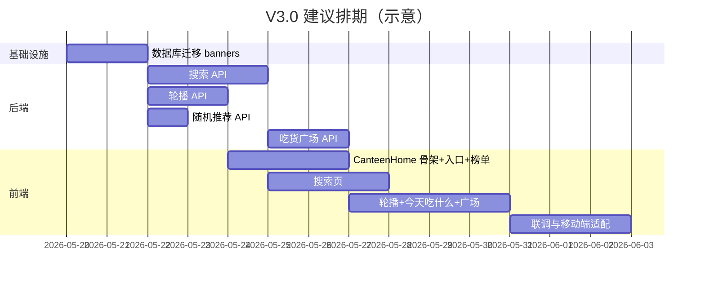

# 食堂模块入口页开发计划（V3.0 → V3.1）

**依据设计文档：** `docs/02-设计文档/Dorm 食堂模块入口页设计文档（V3.0 → V3.1）.md`  
**项目：** Dorm · XMUMDorm-2.0.0-LYZZ  
**编写目的：** 将设计稿拆解为可执行的前后端任务，便于排期、分工与跨项目迁移。  
**页面定位变更：** 食堂首页由当前 **地图式入口**（`CanteenArea.jsx`）调整为 **工具型首页**（搜索 → 发现 → 热门 → 进区域 → 看菜品）。

**当前状态：** 已完成首轮落地，本文档同步更新为“开发计划 + 当前实现收口说明”。

---

## A. 当前收口结论

基于当前仓库状态，食堂模块入口页第一轮 V3.0 工具型首页已经实际落地，核心证据如下：

- 首页主页面已存在：`frontend/src/pages/CanteenHome.jsx`
- 首页样式已存在：`frontend/src/pages/CanteenHome.css`
- 顶部搜索已存在：`frontend/src/components/canteen/CanteenSearchBar.jsx`
- 搜索结果页已存在：`frontend/src/pages/CanteenSearch.jsx`
- 推荐轮播已存在：`frontend/src/components/canteen/CanteenBannerCarousel.jsx`
- 食堂入口宫格已存在：`frontend/src/components/canteen/CanteenRegionGrid.jsx`
- 首页排行榜已存在：`frontend/src/components/canteen/CanteenHomeRankings.jsx`
- 今天吃什么已存在：`frontend/src/components/canteen/CanteenPickMeal.jsx`
- 吃货广场已存在：`frontend/src/components/canteen/CanteenFoodSquare.jsx`
- 路由已接入：`/eat`、`/eat/search`、`/eat/map`
- 共享 API 已接入：`searchCanteen()`、`getCanteenBanners()`、`pickRandomMeal()`、`getFoodArticles()`

因此，这份文档不再只是“从零开发计划”，也用于说明这轮食堂首页任务哪些内容已经兑现、哪些内容仍属于后续增强项。

---

## B. 当前阶段完成度

### B.1 首页结构

- [x] `/eat` 已切换为工具型首页 `CanteenHome.jsx`
- [x] 首页结构已包含顶部搜索、推荐轮播、食堂入口宫格、首页排行榜、今天吃什么、吃货广场
- [x] `/eat/map` 已保留为地图模式入口

### B.2 搜索

- [x] `searchCanteen(q, options)` 已在共享 API 提供
- [x] `/eat/search` 已存在独立结果页
- [x] 搜索结果已分为 `all / products / articles`
- [x] 点击结果可跳商品详情或帖子详情

### B.3 轮播与区域入口

- [x] `GET /api/canteen/banners` 已有前端接入
- [x] 管理页 `/eat/banners` 已存在
- [x] 区域宫格已复用 `getRegions()`
- [x] 点击区域已跳转 `/eat/:area`

### B.4 排行榜、随机推荐、吃货广场

- [x] 首页排行榜组件已存在并支持三类榜单切换
- [x] “今天吃什么”组件已存在并接入随机推荐 API
- [x] “吃货广场”组件已存在并接入文章流
- [x] “写美食帖”已和发帖链路打通

### B.5 路由与集成

- [x] `layoutRoutes.jsx` 已接入 `/eat`
- [x] `layoutRoutes.jsx` 已接入 `/eat/search`
- [x] `layoutRoutes.jsx` 已接入 `/eat/map`
- [x] `Layout.jsx` 已识别相关标题

---

## 0. 现状纵览（开发前必读）

### 0.1 已有能力（可复用）

| 能力 | 前端 | 后端 | 说明 |
|------|------|------|------|
| 区域与商家浏览 | `MerchantList.jsx`、`/eat/:area` | `GET /api/canteen/regions`、`/regions/:id/shops` | 五区 code：`D6` / `LY3` / `B1` / `BELL` / `other` |
| 商品与点评 | `FoodList`、`FoodDetail`、`FoodReviewPublish` | `products/*`、`product_comments` 等 | 核心交易路径完整 |
| 排行榜（独立页） | `Rankings.jsx`、`/eat/rankings` | 5 个 `GET /api/canteen/rankings/*` | 与设计「菜品榜/店铺榜/新品榜」需做 **Tab 映射** |
| 分区榜 | `AreaProductRanking.jsx` | `regions/.../top-products` | 可按区域展示 Top 商品 |
| 帖子关键词搜索 | `PostSearch.jsx`、`getPostList({ q })` | `routes/posts.js` 内 `content LIKE` | **仅帖子**，未含菜品 |
| 店铺营业时间字段 | 商家编辑页可维护 | `shops.opening_hours`（迁移 005） | V3.1「营业状态」有数据基础，缺 **解析与展示 API** |
| 地图式食堂首页 | `CanteenArea.jsx`（`/eat`） | — | V3.0 需 **新建工具首页** 或替换默认路由 |

### 0.2 设计目标与缺口

| 设计模块（V3.0） | 现状 | 缺口等级 |
|------------------|------|----------|
| 1. 统一搜索（菜品 + 美食文章） | 仅帖子搜索 | **高** — 需新聚合搜索 API + 食堂首页搜索 UI |
| 2. 推荐轮播 | 无 | **高** — 需运营位数据模型 + 管理/下发 API + 轮播组件 |
| 3. 食堂入口 Bell/D6/LY3/B1/Others | 地图贴图跳转 | **中** — UI 改为工具型宫格；路由可复用 `/eat/:area` |
| 4. 排行榜（首页区块 + Tab） | 独立页已有 | **中** — 首页嵌入精简版 + Tab 与设计对齐 |
| 5. 今天吃什么 | 无 | **中** — 随机推荐 API 或规则 + 弹层/结果卡 |
| 6. 吃货广场（文章流） | 无专用流 | **高** — 需定义内容源（帖子标签 / 新表）+ 列表 API + 流式 UI |

### 0.3 建议路由规划

| 路径 | 组件（建议命名） | 说明 |
|------|------------------|------|
| `/eat` | `CanteenHome.jsx`（新） | **V3.0 工具型首页**（设计主页面） |
| `/eat/map` | `CanteenArea.jsx`（迁出或保留） | 可选：保留原地图入口作彩蛋/二级入口 |
| `/eat/search` | `CanteenSearch.jsx`（新） | 统一搜索结果页 |
| `/eat/rankings` | `Rankings.jsx`（已有） | 排行榜全页；首页区块链到此页 |
| `/eat/:area` | `MerchantList.jsx`（已有） | 区域商家列表 |
| 其余 | 不变 | `merchant/:id`、`food/:id` 等 |

---

## 1. 目标页面结构（V3.0）

自上而下（与设计文档一致）：

```
顶部搜索
  ↓
推荐轮播区域
  ↓
食堂入口（Bell / D6 / LY3 / B1 / Others）
  ↓
排行榜（Tab：菜品榜 | 店铺榜 | 新品榜）
  ↓
今天吃什么
  ↓
吃货广场（文章流）
```

**核心用户路径：** 搜索 → 发现内容 → 查看热门 → 进入对应食堂 → 浏览菜品。

当前代码已基本符合这条主路径。

---

## 2. V3.0 开发计划

> 优先级与设计文档一致：六项均为 V3.0 必做。建议实施顺序见 **§2.4**。
> 本章保留原始拆解，作为回溯依据；不再表示这些事项仍需从零开发。

---

### 2.1 模块一：搜索

#### 应用场景

- 用户在食堂首页顶部输入关键词（如「榴莲」）。
- 结果分两组展示：**菜品**（商品名、店铺、区域）与 **美食文章**（帖子标题/摘要）。
- 支持模糊匹配；点击条目进入商品详情或帖子详情。

#### 前端任务

| # | 任务 | 产出 | 依赖 |
|---|------|------|------|
| F-S1 | 新建 `CanteenHome` 顶部搜索栏组件 `CanteenSearchBar` | 输入框 + 搜索按钮；回车/点击跳转 `/eat/search?q=` | — |
| F-S2 | 新建 `CanteenSearch.jsx` + `CanteenSearch.css` | 分 Tab 或分 Section：`菜品` / `文章`；空态、加载、错误态 | B-S1 |
| F-S3 | `api/canteen.js` 增加 `searchCanteen(q, options)` | 对接 `GET /api/canteen/search` | B-S1 |
| F-S4 | `queryKeys.js` 增加 `canteenSearch(q)` | React Query 缓存与防抖（建议 300ms） | F-S3 |
| F-S5 | 结果行 UI：菜品卡（图、名、店、区、评分）；文章卡（复用 `PostCard` 或轻量卡片） | 与现有 `FoodDetail`、`PostDetail` 路由跳转 | F-S2 |
| F-S6 | `Layout.jsx` 为 `/eat/search` 配置标题「搜索」与返回 | — | F-S2 |

#### 后端任务

| # | 任务 | 产出 | 依赖 |
|---|------|------|------|
| B-S1 | 新增 `GET /api/canteen/search?q=&page=&pageSize=&type=` | 聚合返回 `{ products: [], articles: [] }` 或 `type=all` 时分组 | DB |
| B-S2 | **菜品**：`products.name`、`products.description`（可选 `shops.name`）`LIKE %q%`；过滤 `deleted_at`；限制条数（如各 20） | SQL + 索引评估 | — |
| B-S3 | **文章**：复用帖子表 `posts`，`content LIKE %q%`；增加 **频道过滤**（如 `channel=eat` 或 tag 含美食类，与产品约定） | 与 `routes/posts.js` 逻辑对齐，避免重复实现时可抽 `searchPosts(q)` 服务函数 | — |
| B-S4 | 统一分页、排序（菜品可按 `comprehensive_score`；文章按 `created_at`） | 响应结构文档化 | B-S2、B-S3 |
| B-S5 | 限流：复用现有限流中间件；`q` 长度校验（1–50 字符） | — | — |
| B-S6 | 缓存（可选）：`simpleCache` key `canteen:search:${hash(q)}`，TTL 60s | 降低热点词压力 | — |

#### 参数设计（API 草案）

```
GET /api/canteen/search?q=榴莲&page=1&pageSize=10&type=all|products|articles

Response 200:
{
  "q": "榴莲",
  "products": [
    {
      "id": 1,
      "name": "榴莲千层",
      "shop_id": 2,
      "shop_name": "xxx",
      "region_code": "LY3",
      "cover_url": "...",
      "comprehensive_score": 4.2
    }
  ],
  "articles": [
    {
      "id": 100,
      "title_or_excerpt": "《XMUM榴莲攻略》",
      "author": { "id", "name", "avatar" },
      "created_at": "..."
    }
  ],
  "hasMore": { "products": false, "articles": true }
}
```

---

### 2.2 模块二：推荐轮播

#### 权限分配

管理员admin在轮播图旁边有编辑按钮，可以去除，添加轮播图

其他权限的用户无法编辑轮播图内容

#### 应用场景

- 首页顶部展示运营推荐：今日热门、新品、活动、商家广告等。
- 原则：**内容推荐优先，广告补充**；支持点击跳转（商品/店铺/帖子/H5）。

#### 前端任务

| # | 任务 | 产出 | 依赖 |
|---|------|------|------|
| F-C1 | 轮播组件 `CanteenBannerCarousel`（可基于现有 `StackedCardCarousel` 或 swiper） | 自动轮播、指示点、手势滑动 | B-C1 |
| F-C2 | 嵌入 `CanteenHome` 轮播区；区分 `type: content \| ad` 样式（广告角标可选） | — | F-C1、B-C1 |
| F-C3 | `api/canteen.js` → `getCanteenBanners()` | — | B-C1 |
| F-C4 | 点击跳转：`link_type` + `link_target`（product/shop/post/url） | 统一 `navigate` 或 `window.open` | B-C1 |

#### 后端任务

| # | 任务 | 产出 | 依赖 |
|---|------|------|------|
| B-C1 | 新增 `GET /api/canteen/banners` | 返回当前生效轮播列表（按 `sort_order`） | 迁移 |
| B-C2 | 数据表 `canteen_banners`（建议字段见下） | `migrations/00x_canteen_banners.sql` | — |
| B-C3 | 管理端（可二期）：`POST/PATCH/DELETE /api/canteen/banners`（`role=admin`） | 运营可配置；V3.0 可先用 **种子数据 SQL** | B-C2 |
| B-C4 | 缓存 `canteen:banners:v1`，TTL 5–10 分钟 | — | B-C1 |

**表结构建议（`canteen_banners`）**

| 字段 | 类型 | 说明 |
|------|------|------|
| id | INT PK | |
| type | ENUM('content','ad') | 内容推荐 / 商家广告 |
| title | VARCHAR(100) | 展示标题 |
| subtitle | VARCHAR(200) NULL | 副标题 |
| image_url | VARCHAR(500) | 对象存储或静态 URL |
| link_type | ENUM('none','product','shop','post','url','region') | |
| link_target | VARCHAR(200) NULL | id 或 URL 或 region code |
| sort_order | INT | 越小越靠前 |
| starts_at / ends_at | TIMESTAMP NULL | 定时上下线 |
| is_active | TINYINT(1) | |
| created_at / updated_at | TIMESTAMP | |

---

### 2.3 模块三：食堂入口

#### 应用场景

- 首页中部五宫格：Bell、D6、LY3、B1、Others。
- 点击进入对应区域商家列表（现有 `MerchantList`）。

#### 前端任务

| # | 任务 | 产出 | 依赖 |
|---|------|------|------|
| F-E1 | 组件 `CanteenRegionGrid`：5 个入口，展示名与设计一致（Bell / D6 / LY3 / B1 / Others） | 图标可用现有 `/public` 资源或简化矢量 | `getRegions()` |
| F-E2 | 点击 `navigate('/eat/' + code)`，`other` 与设计 Others 对齐（当前路由为 `other`） | 确认 code 映射表 | — |
| F-E3 | 可选：在首页底部保留「地图模式」链接 → `/eat/map` | 不丢失原 `CanteenArea` 体验 | — |

#### 后端任务

| # | 任务 | 产出 | 依赖 |
|---|------|------|------|
| B-E1 | **无必须新接口**；复用 `GET /api/canteen/regions` | 确保返回 5 区及 `sort_order` | 已有 |
| B-E2 | （可选）`regions` 表增加 `icon_url`、`display_name_en` | 便于运营改展示名 | 迁移 |

---

### 2.4 模块四：排行榜（首页区块）

#### 应用场景

- 首页展示 **精简榜单**，Tab：**菜品榜 | 店铺榜 | 新品榜**。
- 「查看更多」进入 `/eat/rankings` 全页。

#### 与设计 / 现有 API 映射

| 设计 Tab | 推荐对接接口 | 现有榜单名 |
|----------|--------------|------------|
| 菜品榜 | `GET /rankings/hot-products` | 最夯单品 Top 5 |
| 店铺榜 | `GET /rankings/top-shops`（主）+ `busy-shops`（副指标可选） | 最夯商家 / 门庭若市 |
| 新品榜 | `GET /rankings/new-hit-products` | 爆款新品 Top 3 |

> 全页 `Rankings.jsx` 仍可保留 5 榜；首页仅展示与设计一致的 3 Tab。

#### 前端任务

| # | 任务 | 产出 | 依赖 |
|---|------|------|------|
| F-R1 | 组件 `CanteenHomeRankings`：3 Tab + 每 Tab Top N 列表（建议 N=5） | 复用 `Rankings.css` 玻璃态样式 | 已有 rankings API |
| F-R2 | 并行请求 3 个接口或封装 `fetchHomeRankings()` | `useQuery` + `QK.canteenHomeRankings()` | `api/rankings.js` |
| F-R3 | 列表项点击：商品 → `/eat/food/:id`；店铺 → `/eat/merchant/:id` | — | — |
| F-R4 | 「查看完整排行榜」→ `/eat/rankings` | — | — |

#### 后端任务

| # | 任务 | 产出 | 依赖 |
|---|------|------|------|
| B-R1 | **无必须新接口**；确认 3 个榜单缓存与每周一东八区刷新逻辑正常 | 文档指向 `routes/canteen.js` 1618+ 行 | 已有 |
| B-R2 | （可选）`GET /api/canteen/rankings/home` 一次返回三榜，减少首页 3 次 RTT | 聚合接口 + 缓存 | 性能优化 |

---

### 2.5 模块五：今天吃什么

#### 应用场景

- 文案：「不知道吃什么？」+ 按钮「帮我决定」。
- 点击后随机推荐一道菜（或一家店），可再次随机。

#### 前端任务

| # | 任务 | 产出 | 依赖 |
|---|------|------|------|
| F-P1 | 组件 `CanteenPickMeal`：按钮 + 结果卡片（图、菜名、店名、去详情） | 加载动画、再摇一次 | B-P1 |
| F-P2 | 未登录/无数据时空态与错误提示 | — | B-P1 |
| F-P3 | `api/canteen.js` → `pickRandomMeal()` | — | B-P1 |

#### 后端任务

| # | 任务 | 产出 | 依赖 |
|---|------|------|------|
| B-P1 | 新增 `GET /api/canteen/pick-random` | 返回单个商品（含 shop、region、cover） | — |
| B-P2 | 随机策略（建议）：从「有图 + 有评分 + 近 30 天有点评」的商品池中 `ORDER BY RAND() LIMIT 1`；或加权（高分权重更高） | 避免抽到无图垃圾数据 | — |
| B-P3 | 可选：排除上次结果 `exclude_id` query | 提升「再摇一次」体验 | B-P1 |
| B-P4 | 限流：每 IP/用户 每分钟最多 30 次 | 防刷 | — |

---

### 2.6 模块六：吃货广场

#### 应用场景

- 首页底部 **美食文章流**：测评、攻略、避雷、探店等 UGC。
- 列表无限滚动；点击进入帖子详情。

#### 内容源决策（需产品确认，开发计划默认方案）

**推荐方案 A（V3.0 最快）：** 复用 **帖子系统**，通过 `tag` 或 `channel` 标识美食帖。


| 方案 | 优点 | 缺点 |
|------|------|------|
| A. 帖子 + 美食 tag/channel | 无新表、可复用发帖/评论/点赞 | 需规范 tag；与树洞混排风险 |
|  |  |  |

以下任务按 **方案 A** 列出；

#### 前端任务

| # | 任务 | 产出 | 依赖 |
|---|------|------|------|
| F-F1 | 组件 `CanteenFoodSquare`：`useInfiniteQuery` 文章流 | 卡片样式与树洞区分（美食向） | B-F1 |
| F-F2 | 首页仅展示前若干条 + 「进入广场」→ 独立页 `/eat/square`（可选） | — | F-F1 |
| F-F3 | `api/canteen.js` 或 `api/posts.js` → `getFoodArticles({ page, pageSize })` | — | B-F1 |
| F-F4 | 空态引导：「写一篇美食测评」→ 发帖页并预填 tag（若支持） | — | 发帖流程 |

#### 后端任务

| # | 任务 | 产出 | 依赖 |
|---|------|------|------|
| B-F1 | 新增 `GET /api/canteen/food-articles?page=&pageSize=` | 返回帖子列表（过滤美食 tag/channel） | posts 表 |
| B-F2 | 与 `GET /api/canteen/search` 中 `articles` 使用 **同一过滤规则** | 避免搜索与广场不一致 | B-S3、B-F1 |
| B-F3 | （可选）管理端置顶 `is_featured` 字段或 `food_article_pins` 表 | 运营精选 | 迁移 |

---

### 2.7 V3.0 页面总装（前端）

| # | 任务 | 产出 |
|---|------|------|
| F-H1 | 新建 `CanteenHome.jsx` + `CanteenHome.css`，组装 S1–F6 全部区块 | 工具型首页 |
| F-H2 | `layoutRoutes.jsx`：`/eat` → `CanteenHome`；`/eat/map` → `CanteenArea`（可选） | 路由切换 |
| F-H3 | `TabBar` 选中态仍匹配 `/eat` 前缀 | — |
| F-H4 | `Layout.jsx` 标题：「食堂」；子页返回栈正确 | — |
| F-H5 | 视觉：对齐项目液态玻璃 / 卡片规范（参考 `docs/02-设计文档/Archive/液态玻璃设计迁移手册.md`） | UI 一致性 |
| F-H6 | 性能：首页接口并行；轮播/榜单缓存 `staleTime`；移动端减少多层 `backdrop-filter` | 参考 TreeHole 降级策略 |

---

### 2.8 V3.0 建议实施顺序与里程碑



| 里程碑 | 交付物 | 验收标准 |
|--------|--------|----------|
| M1 | 后端：regions 复用 + banners 表与 GET + pick-random | Postman/接口文档通过 |
| M2 | 后端：search 聚合 + food-articles 列表 | 输入「榴莲」能返回菜品+文章 |
| M3 | 前端：CanteenHome 上线（入口+榜单+轮播） | `/eat` 为工具首页，五区可点 |
| M4 | 前端：搜索页 + 今天吃什么 + 吃货广场 | 核心路径可走通 |
| M5 | 全量联调 + 性能与 iOS 滚动测试 | 无明显 blank、卡顿 |

---

## 3. V3.1 开发计划（扩展，当前仅预留）

> 设计文档标注 V3.1 为扩展能力；建议在 V3.0 稳定后再开。

---

### 3.1 最近浏览

| 端 | 任务 |
|----|------|
| **后端** | 表 `canteen_browse_history`（`user_id`, `target_type` product/shop, `target_id`, `viewed_at`）；`POST` 上报浏览、`GET` 最近列表（去重、限 20 条） |
| **前端** | 在 `FoodDetail` / `MerchantList` 进入时上报；首页区块「最近浏览」横滑；需登录 |

---

### 3.2 营业状态

| 端 | 任务 |
|----|------|
| **后端** | 解析 `shops.opening_hours`（如 `07:00-21:00`）；`GET /shops/:id` 增加 `is_open_now`（按东八区）；区域列表可带汇总「营业中商家数」 |
| **前端** | 商家卡片角标「营业中 / 已关闭」；入口页可选展示 |

---

### 3.3 社交热度

| 端 | 任务 |
|----|------|
| **后端** | 从帖子 tag / 话题统计近 7 天频次；`GET /api/canteen/trending-topics?limit=5` |
| **前端** | 首页「最近讨论」#标签 横滑；点击带 tag 进搜索或广场 |

---

### 3.4 智能推荐

| 端 | 任务 |
|----|------|
| **后端** | 基于浏览、收藏、点评行为打分；推荐接口 `GET /api/canteen/recommendations`；可先做规则版，后接模型 |
| **前端** | 替换或补充轮播区「为你推荐」；需登录态 |

---

### 3.5 搜索扩展：标签搜索

| 端 | 任务 |
|----|------|
| **后端** | `GET /api/canteen/search?tags=麻辣,早餐` 或 `tag=夜宵`；商品 tag 表或 posts tag 索引 |
| **前端** | 搜索页热门标签 chips；与设计示例（麻辣/早餐/低卡/夜宵/甜食）一致 |

---

## 4. 测试计划（V3.0）

| 类型 | 内容 |
|------|------|
| 接口 | search、banners、pick-random、food-articles 边界（空 q、超长 q、无结果） |
| 前端 | 首页各区块加载失败互不影响（Error Boundary 或分块 error 态） |
| 路由 | `/eat` → 区域 → 店铺 → 商品 → 返回首页栈正确 |
| 兼容 | iOS Safari：轮播横滑、backdrop 层数控制 |
| 回归 | 原 `/eat/rankings`、`/eat/:area` 不受影响 |

---

## 5. 文件与目录清单（实施参考）

### 5.1 前端（新建/修改）

| 文件 | 操作 |
|------|------|
| `frontend/src/pages/CanteenHome.jsx` | 新建 |
| `frontend/src/pages/CanteenHome.css` | 新建 |
| `frontend/src/pages/CanteenSearch.jsx` | 新建 |
| `frontend/src/components/canteen/CanteenSearchBar.jsx` | 新建（可选目录） |
| `frontend/src/components/canteen/CanteenBannerCarousel.jsx` | 新建 |
| `frontend/src/components/canteen/CanteenRegionGrid.jsx` | 新建 |
| `frontend/src/components/canteen/CanteenHomeRankings.jsx` | 新建 |
| `frontend/src/components/canteen/CanteenPickMeal.jsx` | 新建 |
| `frontend/src/components/canteen/CanteenFoodSquare.jsx` | 新建 |
| `frontend/src/api/canteen.js` | 扩展 search、banners、pick-random、food-articles |
| `frontend/src/query/queryKeys.js` | 扩展 |
| `frontend/src/routes/layoutRoutes.jsx` | 修改 `/eat` 路由 |
| `frontend/src/components/Layout.jsx` | 补充标题映射 |

### 5.2 后端（新建/修改）

| 文件 | 操作 |
|------|------|
| `routes/canteen.js` | 增加 search、banners、pick-random、food-articles（及可选 rankings/home） |
| `migrations/00x_canteen_banners.sql` | 新建 |
| `migrations/00x_posts_channel_or_tags.sql` | 若采用美食 channel/tag 方案 |
| `scripts/run-migrations-all.js` | 注册新迁移 |

---

## 6. 风险与依赖

| 风险 | 缓解 |
|------|------|
| 吃货广场内容源未定义 | 开工前产品确认：帖子 tag 列表或新表；默认方案 A |
| 地图首页下线引发用户习惯变化 | 保留 `/eat/map` 入口一版 |
| 搜索仅 LIKE 性能差 | 数据量增大后加 FULLTEXT 或 ES；V3.0 可接受 |
| 轮播无运营后台 | V3.0 用 SQL 种子 + 管理端可放到 V3.1 |
| 排行榜 Tab 与 5 榜全页不一致 | 文档化映射；全页保留 5 榜 |

**外部依赖：** 对象存储（轮播图、商品图）、现有登录态（浏览历史上报）、帖子发帖流程（广场 UGC）。

---

## 7. 验收对照表（与设计文档）

### 当前验收判断

结合当前实现状态，可确认以下事项已经成立：

- [x] 食堂首页默认入口已经是工具型首页，不再是旧地图页
- [x] 搜索、轮播、入口宫格、排行榜、随机推荐、吃货广场都已在首页出现
- [x] 二级路由跳转链路存在
- [x] 管理轮播入口存在

当前更适合继续推进的是精修与增强，而不是重新开一轮首页基础搭建。

### V3.0

| 设计项 | 前端验收 | 后端验收 |
|--------|----------|----------|
| 搜索模块 | 首页可搜；结果分菜品/文章 | `GET /canteen/search` 可用 |
| 推荐轮播 | 首页自动轮播；可点击跳转 | `GET /canteen/banners` 可配置至少 3 条 |
| Bell/D6/LY3/B1/Others | 五入口进区域列表 | regions 接口正常 |
| 排行榜 | 三 Tab 展示；可进全页 | 三榜数据正确 |
| 今天吃什么 | 点击出随机菜品 | pick-random 可用 |
| 吃货广场 | 首页文章流可刷 | food-articles 列表可用 |

### V3.1

| 设计项 | 状态 |
|--------|------|
| 最近浏览 | 待开发 |
| 营业状态 | 待开发（字段部分已有） |
| 社交热度 | 待开发 |
| 智能推荐 | 待开发 |
| 标签搜索 | 待开发 |

---

## 8. 当前遗留项

以下内容建议视为后续增强项，而不是阻塞当前任务完成的硬缺口：

1. 搜索结果页仍可继续做更强的桌面化排版与卡片精修。
2. 首页排行榜当前是前端并行拉取 3 个接口，若后续追求性能，可再评估聚合接口。
3. 吃货广场的封面图与缩略图策略，在缺陷修复计划里仍有进一步优化空间。
4. 轮播管理、运营位能力虽然已经存在，但后续仍可继续增强表单体验与约束校验。
5. 如果后续要做 V3.1，则可以继续扩营业状态解析、标签过滤和更细的推荐策略。

---

## 9. 结论

`M03-Task001` 对应的“食堂入口工具型首页”第一轮开发任务，可以视为已完成并进入维护/增强阶段。

后续如果继续拆食堂模块，更合适的方向不是重复首页基础建设，而是继续拆：

- 搜索结果页桌面化与细节精修
- 吃货广场内容节奏优化
- 随机推荐与榜单推荐策略增强
- 轮播管理与运营配置体验增强

---

## 10. 修订记录

| 版本 | 日期 | 说明 |
|------|------|------|
| 1.0 | 2026-05-17 | 初版：依据食堂入口页设计文档 V3.0→V3.1，结合仓库现状拆分前后端任务 |
| 1.1 | 2026-07-04 | 补充当前实现收口说明，确认 V3.0 工具型首页已落地 |
