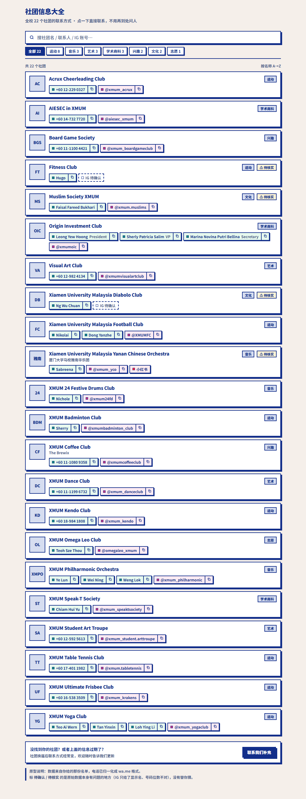
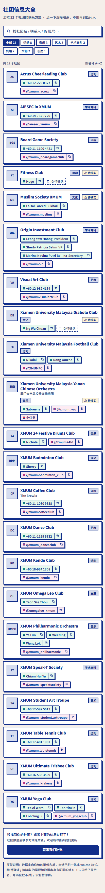

# 社团信息页 · UI 设计方案

> 2026-10-06。为「社团」模块新增一个**联系信息总表**页面。
> **本方案已实现**（`frontend/src/pages/Clubs/ClubDirectoryPage.jsx`，路由 `/about/club/directory`），
> 实现记录见 `docs/07-Implement/社团信息页.md`。
> 原型（可交互，能搜能筛）：[社团信息页UI设计原型.html](./社团信息页UI设计原型.html)





---

## 1. 一句话

把「我想找某个社团，怎么联系他们」从**靠群问人**变成**打开一个页面就能搜到并直接发起对话**。

## 2. 这个页面解决什么问题

| | 现状 | 这个页面 |
| --- | --- | --- |
| 想加某个社团 | 问学长 / 翻群公告 / 找认识的人要微信 | 搜一下，点 WhatsApp 直接聊 |
| 社团换届后联系方式变了 | 没人知道去哪更新 | 集中一处，一处改全站对 |
| 新生不知道学校有哪些社团 | 只能靠百团大战当天逛 | 22 个社团一次看完，按类别筛 |

**核心用户动作排序**（决定了 UI 取舍）：**搜 → 认 → 联系**。
所以页面第一优先级是**搜索**和**「点一下就发起对话」**，不是好看。

## 3. 放在哪里

| 项 | 值 |
| --- | --- |
| 路由 | `/about/club/directory` |
| 入口 | `ClubsHome` 顶部的功能卡区（现在是「社团大全 / 我的社团」两张卡，加成三张） |
| 登录 | 不需要，公开页 |
| 底栏 | 属于社团模块，`siteShellNav` 的「社团」`matchPrefixes` 已覆盖 `/about/club` |

> ⚠️ **命名冲突（需要你拍板）**：现有 `/about/club/list` 的入口卡片**已经叫「社团大全」**。
> 再放一个「社团信息页」并列，用户分不清。见 §9 决策 1。

## 4. 页面结构（自上而下）

```
┌─ 社团信息页            ← 22px / 900 / 跟其它社团页同款 neo 标题
│  全校 22 个社团的联系方式 · 点一下直接联系，不用再到处问人
├─ [🔍 搜社团名 / 联系人 / IG 账号…]      ← 2px 蓝框 + 4px 硬投影，吸顶
│  [全部 22][运动 8][音乐 3][艺术 3][学术商科 3][兴趣 2][文化 2][志愿 1]
├─ 共 22 个社团                                    按名称 A→Z
├─ 一条一个社团（详见 §5）
│  …
├─ 没找到你的社团？或者上面的信息过期了？   [联系我们补充]
└─ 原型说明脚注
```

设计要点：

- **搜索与筛选吸顶**。22 条不算长，但用户往往是「我知道我要找谁」，吸顶让搜索永远在手边。
- **筛选 chip 带数量**（`运动 8`），让人知道点了会剩几条，不用点进去试。
- **A→Z 排序**并明写出来，让「大全」有可预期的顺序；不按热度排，因为这是通讯录不是信息流。
- **不用分组大标题**。6 个类别用 chip 筛比用 6 段折叠更好，因为跨类别找人是常见需求。

## 5. 一条（Row）的解剖

```
┌────────────────────────────────────────────────────────┐
│ ┌────┐  Xiamen University Malaysia Yanan Chinese Orchestra   [音乐] [⚠待核实] │
│ │雅南│  厦门大学马校雅南华乐团                                        │
│ └────┘  [▪ Sabreena ⧉] [▪ @xmum_yco ⧉] [▪ 小红书]                    │
└────────────────────────────────────────────────────────┘
```

| 部位 | 规格 | 说明 |
| --- | --- | --- |
| 外框 | `border:2px #122E8A` + `box-shadow:4px 4px 0 #122E8A`，hover 变 `2px 2px` 并内移 | 直接复用 `NeoCard` 的语言 |
| 缩写块 | 52×52（窄屏 44），2px 边框，`--ru-muted` 底，900 字重 | **社团没有 logo**，用缩写当视觉锚点便于扫读 |
| 名称 | 15px/900，`letter-spacing:-.01em` | 中文名作为第二行小字 |
| 类别 | `NeoBadge` 灰底 | |
| 渠道胶囊 | 见 §6 | |
| 存疑标记 | 琥珀底 `⚠ 待核实`，`margin-left:auto` 靠右 | 见 §7 |

**为什么不用卡片网格**：官方全名很长（`Xiamen University Malaysia Football Club`），
两列会把名字挤成三行；而且联系胶囊最多的一条（Origin Investment）有 3 个带职位的联系人，
在 420px 宽里必然折行。**单列整宽**在这一页是对的。

## 6. 渠道胶囊（这一页的主角）

每个渠道 = 一个独立胶囊：**左边是链接，右边是复制按钮**，两者是并列的两个可交互元素
（不是 button 套在 a 里，避免无障碍问题）。

| 渠道 | 底色 | 图标点色 | 点击行为 | 右侧复制 |
| --- | --- | --- | --- | --- |
| WhatsApp | `#E7F9EE` | `#128C7E` | `https://wa.me/<纯数字>` 新窗口 | 复制裸号码 |
| Instagram | `#FDEBF3` | `#C13584` | `https://instagram.com/<handle>` | 复制 handle |
| 小红书 | `#FFECEF` | `#FF2442` | 原文链接 | — |

**胶囊文字显示什么（重要）**：

- 有联系人姓名 → 显示姓名（`Sabreena`），有职位则跟在后面（`Leong Yew Hoong President`）
- **没有姓名 → 显示号码本身**（`+60 17-401 1982`），而不是一个只写「WhatsApp」的按钮

第二条是设计上最关键的修正。原始名单里 **9 个社团只给了号码、没给联系人**，
如果胶囊只写「WhatsApp」，这些行会长得一模一样、用户也无法核对号码对不对。
显示号码后，22 行立刻有了区分度。

**悬停/按下**：不做变色填充（WhatsApp 绿底白字对比度只有约 1.9:1，不合格），
统一用这套设计系统既有的**硬投影位移**（`4px→2px` + `translate`）表达按下。

## 7. 缺失与存疑数据怎么显示

这是本页最容易做砸的地方：**「没有」和「不知道」必须区分开**。

| 情况 | 显示 | 理由 |
| --- | --- | --- |
| 原文没给 Instagram | 虚线框 `暂无 Instagram` | 陈述事实 |
| 原文只给了 IG **显示名**（不是 handle） | 虚线框 `IG 待确认` + 行右侧 `⚠ 待核实` | **不能拿显示名去拼 instagram.com/xxx 的链接**，会 404。必须人工确认 |
| 号码位数不对 | 照常显示号码 + `⚠ 待核实` | 让人一眼看出可疑，而不是替他猜一个「补全」的号 |
| 联系人已注明「Former President」 | `⚠ 待核实` | 可能已换届，标注比沉默好 |

本页**没有**替任何人猜数据。见 §8。

## 8. 从原始名单里查出来的问题（需要你确认）

我逐条核过你那份 `Club name AIESEC in XMUM.md`，原文格式非常不统一。以下是我发现、**没有自行修改**的问题：

**a. 号码格式混乱，已全部归一化成 `wa.me` 所需格式**（这一项我已经处理了）

| 原文写法 | 归一化后 |
| --- | --- |
| `+60 14-732 7720` | `60147327720` |
| `+60176211470` | `60176211470` |
| `016-5383509` | `60165383509` |
| `011-1080 9358` | `601110809358` |
| `62895392153888`（印尼号） | 原样保留国家码 |
| `+923457080076`（巴基斯坦号） | 原样保留国家码 |

**b. 有 1 个号码位数不对（疑似漏位）**

- **Yanan Chinese Orchestra**：`016411123` 只有 9 位。马来西亚手机号应为 10–11 位。
  我**没有**猜补成 `016-411 1234` 之类，原样显示并标了「待核实」。

**c. 有 2 个社团只给了 Instagram 显示名，不是账号**

- **Diabolo Club**：`Xmum Diabolo Club`（这是页面上的名字，不是 handle）
- **Fitness Club**：`Xmum Fitness | Gym Club`（同上，还带竖线）

这两个点进去会 404，所以标成「IG 待确认」，没有拼链接。

**d. 有 1 个联系人注明是「Former President」**

- **Muslim Society XMUM** 的 Faisal Fareed Bukhari 标的是 `Former President`，可能已经换届。

**e. 类别是我推断的，需要你复核**

原始名单**完全没有类别**。我按社团名推断出 7 类（运动 8 / 音乐 3 / 艺术 3 / 学术商科 3 /
兴趣 2 / 文化 2 / 志愿 1）。这些分类是我的判断，请复核——尤其是
`AIESEC`（我归学术商科）、`24 Festive Drums`（我归音乐，也可能算文化）。

## 9. 四个决策（已定）

> **2026-10-06 所有者裁定：**
> **① 页面叫「社团信息页」**（现有 `/about/club/list` 保持「社团大全」不改名）
> **② 不入库** —— 用静态文件 `shared/config/clubDirectory.js`
> **③ 不做**「已入驻 Dorm」徽章
> **④ 那 4 处「待核实」原样放着**，不做核实流程
>
> 下面是当时的取舍记录，保留以便回溯。

### 决策 1：新页面叫什么？（影响用户能否分清两个页面）

| 方案 | 现有 `/about/club/list` | 新页面 | 评价 |
| --- | --- | --- | --- |
| A | 保持「社团大全」 | 「社团信息页」 | ❌ 两个名字太像，并列在首页必然混淆 |
| B | 改成「**社团主页**」 | 保持「**社团信息页**」 | ✅ 推荐。「主页」= 能关注能看动态；「信息大全」= 联系方式 |
| C | 改成「入驻社团」 | 改成「**社团黄页**」 | ✅ 也行，「黄页」最直观但略老气 |

### 决策 2：数据放哪？

前提事实：**`clubs` 表里只有 2 个社团**（`DormCommittee`、`XMUM航空摄影联盟`），
**和你这 22 个完全不重合**。所以这 22 条数据**无法复用 `clubs` 表**——必须另起一处。

| 方案 | 做法 | 代价 |
| --- | --- | --- |
| **静态文件** | `shared/config/clubDirectory.js` 直接 export 数组，前端 import | 改一次发一次版。22 条、一年改 1–2 次，其实够用 |
| **DB 新表 + 后台** | 迁移建 `club_directory` 表 + M06 后台 CRUD | 可随时改不用发版，但要迁移 + 接口 + 测试 + 后台页面 |
| **C（推荐）** | 先静态文件，但对外暴露成 `getClubDirectory()` 的**异步签名**（放 `shared/api/`） | 上线快，将来换 DB 时**页面代码一行不用改** |

推荐 **C**：这一页的形状（搜索 + 列表）不会因为数据来源变化而变，
所以把「来源」隔离在一个函数后面，是这里最值钱的一个接缝。

### 决策 3：要不要「已入驻 Dorm」徽章？

原本我想设计一个徽章，标出哪些社团在 Dorm 上有账号、能点进主页。
但**实测 DB 里 2 个社团与这 22 个零重合**，所以这个徽章现在**没有任何一条会命中**。
建议**先不做**，等真的有机社入驻再加。

### 决策 4：谁来核实那 4 处「待核实」？

Diabolo / Fitness 的 IG、雅南的号码、Muslim Society 的换届。
如果没人核实，页面上会一直挂着 4 个 `⚠ 待核实`。
建议：要么在 §5 的底部长驻一个「联系我们补充」入口（原型里已有），
要么先不下这 4 条。

## 10. 与现有社团页的关系

| 页面 | 路由 | 定位 | 数据 |
| --- | --- | --- | --- |
| 社团广场 | `/about/club` | 动态流：活动 + 日常帖 | `clubs` + 帖子 |
| 社团主页（原「社团大全」） | `/about/club/list` | 已入驻社团的卡片墙，可关注 | `clubs` 表 |
| **社团信息页** | `/about/club/directory` | **全校社团联系方式总表** | 新数据源，见决策 2 |

三者是**互补**的：广场看「最近发生了什么」，主页看「有哪些社团能关注」，
信息大全回答「我怎么联系到他们」。

---

## 附：原型里已验证的事实

用 headless Chromium 实测两种宽度，均无横向溢出：

| 检查 | 1000px | 414px |
| --- | --- | --- |
| 渲染出的社团行 | 22 | 22 |
| 分类 chip | 8 | 8 |
| 渠道胶囊 | 52 | 52 |
| `wa.me` 链接 | 29 | 29 |
| Instagram 链接 | 20 | 20 |
| 小红书链接 | 1 | 1 |
| 横向溢出 | 无 | 无 |

> 29 个 `wa.me` 链接 = 22 个社团里 XMPO/Football/Origin/Yoga 等多联系人社团贡献的。
