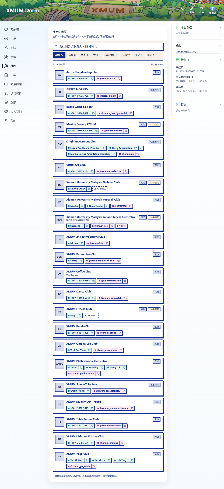

# 社团信息页（全校社团联系方式总表）

> 2026-10-06。为「社团」模块新增 `/about/club/directory`。
> 设计方案见 `docs/06-Analyze/ui-research/社团信息页UI设计方案.md`。

## 需求与裁定

需求原文：「在社团页面，加一个社团信息大全的页面，放上所有社团的名字，联系人 Whatsapp，ins，
小红书（如有）。你设计一下 UI。」

四条决策由所有者当场裁定：

| # | 决策 | 结果 |
| --- | --- | --- |
| ① | 页面叫什么 | **社团信息页**（现有 `/about/club/list` 保持「社团大全」，不改名） |
| ② | 数据放哪 | **不入库** → 静态文件 |
| ③ | 「已入驻 Dorm」徽章 | **不做** |
| ④ | 4 处「待核实」 | **原样放着**，不做核实流程 |

## 交付物

| 文件 | 作用 |
| --- | --- |
| `shared/config/clubDirectory.js` | 22 个社团的静态数据 + 纯函数工具（深链、分类计数、搜索文本） |
| `frontend/src/pages/Clubs/ClubDirectoryPage.jsx` | 页面 |
| `frontend/src/pages/Clubs/ClubDirectory.css` | 页面样式（RetroUI / Neobrutalism 语言） |
| `frontend/src/routes/layoutRoutes.jsx` | 注册懒加载路由 |
| `frontend/src/pages/Clubs/ClubsHome.jsx` | 社团广场加第三张入口卡片 |
| `frontend/src/pages/Clubs/Clubs.css` | 新增 `.club-feature--amber` 配色变体 |
| `__tests__/frontend/clubDirectory.test.js` | 24 例回归测试 |

## 一、为什么数据是静态文件

查了生产库：`clubs` 表里**只有 2 个社团**（`DormCommittee`、`XMUM航空摄影联盟`），
和名单里的 22 个**零重合**。这 22 个社团绝大多数在 Dorm 上没有账号，所以

- 没法复用 `clubs` 表（没有对应的行可以挂联系方式）
- 也没法靠社团自己维护（它们没有登录账号）

而 22 条、一年改 1~2 次的量级，一个代码文件 + 一次发版比「建表 + 后台 CRUD + 接口 + 测试」
更划算。这是所有者裁定「不入库」的依据。

> 顺带一个结论：因为没有重合，原设计里想做的「已入驻 Dorm」徽章**一条都命中不了**，
> 所以决策 ③ 不做是对的。

## 二、三个关键设计决策

### 2.1 胶囊里显示号码，而不是「WhatsApp」

名单里有 **9 个社团只给了号码、没给联系人姓名**。如果胶囊统一写「WhatsApp」，
这 9 行会长得一模一样，用户也没法核对号码对不对。

所以规则是：**有姓名显示姓名，没姓名显示号码本身**。

| | 胶囊文字 |
| --- | --- |
| 错误做法 | `WhatsApp` ← 9 行完全相同 |
| 本实现 | `+60 17-401 1982` ← 每行可区分、可核对 |

### 2.2 绝不拿「IG 显示名」拼链接

名单里 Diabolo Club 和 Fitness Club 给的是**页面显示名**（`Xmum Diabolo Club`、
`Xmum Fitness | Gym Club`），不是 handle。拿它拼 `instagram.com/xxx` 必然 404。

所以数据模型把两者**分开存**：

- `instagram` = 真 handle（可以拼链接）
- `instagramPending` = 原文给的显示名（**只显示「IG 待确认」，不给链接**）

测试里锁死了这条：`expect(pageSrc).not.toMatch(/instagramLink\(\s*club\.instagramPending/)`，
并且断言 `instagram` 与 `instagramPending` 不会同时存在。

### 2.3 「没有」和「不知道」分开显示

| 情况 | 显示 |
| --- | --- |
| 原文没给 IG | 虚线框 `暂无 Instagram` |
| 只给了 IG 显示名 | 虚线框 `IG 待确认` |
| 号码位数不对 / 联系人已卸任 | 实心胶囊照常显示 + 行右侧 `⚠ 待核实` |

## 三、数据清洗记录

原始名单格式有 6 种以上写法，全部归一化成 `wa.me` 所需的纯数字（国家码保留）：

| 原文 | 归一化 |
| --- | --- |
| `+60 14-732 7720` | `60147327720` |
| `+60176211470` | `60176211470` |
| `016-5383509` | `60165383509` |
| `011-1080 9358` | `601110809358` |
| `01111004421` | `601111004421` |
| `62895392153888`（印尼号） | 原样（保留 +62 国家码） |
| `+923457080076`（巴基斯坦号） | 原样（保留 +92 国家码） |

**我没有猜补任何数据**。存疑项原样保留并标记：

| 社团 | 问题 |
| --- | --- |
| Yanan Chinese Orchestra | 号码 `016411123` 只有 9 位（马国应 10–11 位），疑似漏位 |
| Diabolo Club | IG 只给了显示名 |
| Fitness Club | IG 只给了显示名 |
| Muslim Society XMUM | 联系人原文标注「Former President」，可能已换届 |

**类别是我推断的**（原文完全没有分类字段），共 7 类：运动 8 / 音乐 3 / 艺术 3 /
学术商科 3 / 兴趣 2 / 文化 2 / 志愿 1。这是设计者的判断，不是原始数据。

## 四、验证

### 自动化

| 检查 | 结果 |
| --- | --- |
| `npx jest __tests__/frontend/clubDirectory.test.js` | **24 例全绿** |
| `npx jest`（全套） | **48 suites / 698 tests 全绿** |
| `vite build`（frontend） | ✓ |

测试里几条真正防 regression 的断言（不是走形式）：

- 所有号码**纯数字**（带 `+`/空格/横杠会让 `wa.me` 打不开）
- 号码长度 10–15 位；**不足 11 位的必须被标记 `review`**（防漏位号码静默上线）
- `id` 与**缩写块**都唯一（缩写是这一页唯一的扫读锚点，重复会认错社团）
- 每个社团的分类 key 都能解析（写错会渲染出一个没有分类标签的行）
- 页面只用 `club.instagram` 拼链接，绝不碰 `instagramPending`
- 路由注册在 `about/club/:id` **之前**（否则 `:id` 会把 `directory` 吃掉）

> 最后那条测试第一版是错的：文件里那句解释性注释本身就含 `about/club/:id`，
> 用裸子串 `indexOf` 命中的是注释而不是真路由。已改为匹配完整 route 声明。

### 浏览器实测（Playwright + 真实 Vite dev server）

页面**不依赖后端**（数据是静态的），所以只起前端就能验。

| 检查 | 结果 |
| --- | --- |
| 渲染出的社团行 | **22** |
| `wa.me` 链接 | **29**（多联系人社团贡献） |
| Instagram 链接 | **20** |
| 小红书链接 | **1** |
| 虚线「暂无/待确认」胶囊 | **2**（Diabolo、Fitness） |
| `⚠ 待核实` 标记 | **4** |
| 页面标题 | `社团信息页` |
| 格式非法的 `wa.me` 链接 | **0** |
| 由显示名拼出的 IG 链接 | **0** |
| 搜索 `yoga` | 1 条（XMUM Yoga Club，含联系人 Teo Ai Wern） |
| 点「运动 8」分类 | 8 条 |
| 横向溢出（1280px / 414px） | 均无 |
| 页面报错 | 无（仅有被测试脚本主动 abort 的字体请求） |

移动端（414px）另测：同样 **22 行 / 29 个 `wa.me` / 无横向溢出**，页面高度 3185px；
dismiss 掉应用外壳的浮层后点「运动 8」→ **8 条**。

> ⚠️ **移动端第一次跑时 chip 点不动**，排查发现最上层元素是
> `.install-hint-backdrop`（应用外壳的「添加到主屏幕」提示）盖住了整页。
> **这不是本页的缺陷** —— 移除该浮层后 chip 立即正常。记在这里是因为下次
> 用无头浏览器测移动端时还会踩到，不要误判成页面 bug。

## 五、附带发现（未处理）

1. **`clubs.id=4` 的 `contact_text` 仍是 `wechat:YEJIANQIN_git`**。
   2026-09-26 已裁定全站微信号统一为 `xmumdorm666`，但那是**代码层**的改动；
   这是**数据库里的数据**，还没改。要一条 SQL 或迁移来修。
2. **`club-feature-art--mega` / `--badge` 是死类名**。
   `ClubsHome.jsx` 用了这两个 class，但 `Clubs.css` 里没有对应定义 ——
   也就是说那两张卡右下角的装饰块一直是不渲染的（透明）。本次新加的第三张卡
   沿用了同样的（空）类名以保持一致，没有顺手补样式。

## 六、遗留

- 联系方式**没有「上次更新时间」字段**。换届后过期了，页面上看不出来。
  如果以后更新变频繁，值得加一个 `updatedAt` 并显示。
- 页面**没有分页/虚拟滚动**。22 条不需要；如果将来社团数上百，要重新考虑。
- `docs/06-Analyze/ui-research/社团信息页UI设计原型.html` 是设计期的独立原型，
  功能已被 React 实现覆盖。保留它是为了留下设计对照，不是生产代码。
