# 厦马小筑操作手册

## 一、相关文档

| 文档名称 | 指向资料 | 说明 |
| --- | --- | --- |
| 总体设计 | 《总体设计》 | 说明软件整体功能、页面组成、运行环境和业务边界。 |
| 详细设计 | 《详细设计》 | 说明各功能页面、输入输出、状态变化和处理规则。 |
| 测试案例 | 《测试案例》 | 记录主要功能的操作场景、预期结果和异常提示。 |

## 二、说明

厦马小筑 V1.0适用于教育信息化与校园生活服务场景。用户进入系统后，可以围绕实际工作内容完成账号进入、业务创建、过程查看、结果确认和资料管理等操作。

日常使用时，厦门大学马来西亚分校在校学生、校内社团、学院和学校组织的内容负责人、平台内容与用户管理员可以按照页面提示从入口进入相应页面，查看当前业务状态，并根据页面中的按钮、输入框、列表或弹窗继续处理。将校内讨论、校园通知、食堂信息、社团活动、二手交易、跑腿和个人日程集中在同一校园账号下，减少学生在多个群组和渠道之间查找信息的成本。

面向厦门大学马来西亚分校学生的校园生活与社区服务平台，提供移动端和网页端入口。

本手册用于说明软件的用途、功能特点、运行要求和页面操作流程。各功能章节按用户能够看到的页面、入口、按钮、输入项、提示信息和处理结果进行说明。

## 三、功能特点

用户可在账号登录与个人资料页面让学生以校园账号进入平台，并维护自己在平台内显示的资料。页面上的账号与密码输入框、登录或注册按钮、昵称与头像编辑项和语言选择项会集中呈现当前可操作内容，用户处理完成后可以看到登录成功后进入平台首页、保存资料后个人空间和内容中的用户信息同步更新和登录失败显示错误原因并保留可重新输入的表单。

在树洞信息流与匿名发布页面中，用户主要处理供学生围绕校园生活发布和浏览匿名讨论内容。系统把信息流、话题与搜索入口、发布按钮、文本输入区和图片选择入口放在当前操作区域，处理结束后会反馈发布成功后帖子进入相应信息流和点赞、评论和举报操作显示结果提示并更新页面状态。

广场、热搜与校园通知页面关注的是集中展示校园通知、轮播信息、热搜讨论和跨模块服务入口。用户通过轮播图、校园今日标签、学校通知与学院通知标签、热搜词条和社团、二手和跑腿入口确认当前状态，并在操作结束后获得通知发布后进入对应组织信息流和热搜讨论发布后显示在该话题详情中。

用户可在食堂分区、商铺和菜品页面帮助学生查询食堂分区、商铺、菜品和评价信息，并参与信息共建。页面上的食堂分区、商铺列表、菜品列表、分类和新增商铺和菜品入口会集中呈现当前可操作内容，用户处理完成后可以看到新增内容成功后出现在相应列表、评价提交后更新菜品评价信息和管理员删除后内容不再公开显示。

在社团与活动报名页面中，用户主要处理供学生了解社团、查看社团动态并报名参加活动。系统把社团列表、社团主页、动态帖子、活动通知和报名按钮放在当前操作区域，处理结束后会反馈报名成功后显示报名状态并生成事务通知、发布成功后社团主页更新相应内容和报名成功后按钮变为已报名并在信箱收到活动通知。

二手交易与跑腿任务页面关注的是为学生提供校内闲置物品流转和日常跑腿任务协作入口。用户通过分类标签、商品或任务列表、筛选项、搜索入口和发布按钮确认当前状态，并在操作结束后获得发布成功后显示在列表中、状态更新后列表标签和详情状态同步变化和筛选条件变化后列表立即更新。

用户可在课程表、待办与日记页面帮助学生记录课程安排、临时事项和个人日记。页面上的课程周视图、待办列表、新增待办按钮、完成勾选项和日记日历会集中呈现当前可操作内容，用户处理完成后可以看到待办完成状态立即更新并与服务器同步、保存日记后在日历和对应日期中显示记录和课程切换周次后显示对应课程安排。

在站内信箱、举报与后台管理页面中，用户主要处理让用户集中查看互动和事务提醒，并让管理员处理平台治理事项。系统把通知分类标签、未读状态、清空入口、举报原因选择和后台数据概览放在当前操作区域，处理结束后会反馈通知阅读后未读数量更新、举报提交后显示提交结果和管理员处置后目标内容或用户状态发生变化。

## 四、系统要求

| 系统要求 | 最低配置 | 推荐配置 |
| --- | --- | --- |
| 移动端操作系统 | Android 7.0 或更高版本 | Android 12 或更高版本 |
| 网页端浏览器 | Chrome、Edge、Safari 或 Firefox 的近两年版本 | 最新版 Chrome 或 Edge |
| 网络条件 | 可访问互联网并使用 HTTPS | 稳定的 Wi-Fi 或移动数据网络 |

请确保实际运行环境满足以上要求，以保证厦马小筑能够正常打开页面、提交操作和展示处理结果。若部署方式、客户端形态或服务器环境与本表不同，应以实际确认的申请表环境字段为准。

## 五、账号登录与个人资料

用户可在账号登录与个人资料页面让学生以校园账号进入平台，并维护自己在平台内显示的资料。用户可以通过从启动页或个人空间的账户入口进入登录、注册和资料编辑页面。

首次使用时完成注册或登录；需要调整头像、昵称或语言时进入个人资料页。

用户在账号登录与个人资料页面会看到账号与密码输入框、登录或注册按钮、昵称与头像编辑项和语言选择项等信息，并可依据页面显示继续处理。

使用该功能时，用户先填写账号信息并提交登录或注册，随后进入个人资料页修改允许编辑的资料，接着保存后返回个人空间查看更新后的显示信息，之后登录失败时根据提示检查账号、密码和网络状态，再重新提交，最后在资料编辑页选择头像、昵称或语言设置，修改后点击保存并返回个人空间。

页面会按照未登录用户不能进入需要身份的发布和个人事务页面、资料输入不符合格式时显示相应提示、密码输入不能为空，登录失败时不创建登录状态和未保存的资料修改不会覆盖原有资料等规则限制或提示用户。处理结束后，用户可以看到登录成功后进入平台首页、保存资料后个人空间和内容中的用户信息同步更新、登录失败显示错误原因并保留可重新输入的表单和资料保存失败时保留编辑内容，保存成功时显示成功提示。


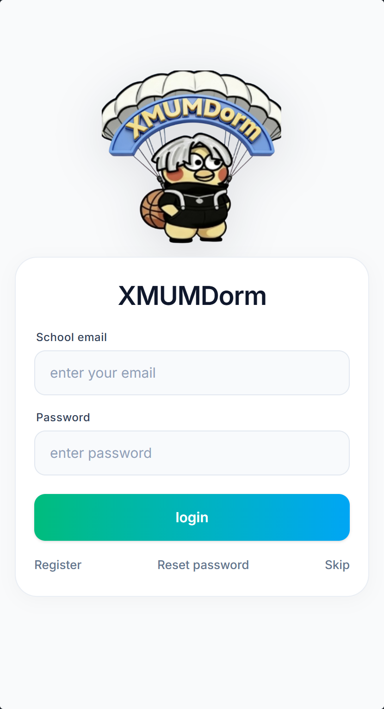

## 六、树洞信息流与匿名发布

用户可在树洞信息流与匿名发布页面供学生围绕校园生活发布和浏览匿名讨论内容。用户可以通过从底部导航进入树洞，点击发布入口创建新帖子，点击信息流条目查看详情。

学生想查看校园讨论、搜索话题或发表匿名想法时使用。

该部分提供信息流、话题与搜索入口、发布按钮、文本输入区、图片选择入口和点赞和评论区等页面内容，用户可据此查看状态、填写信息或选择下一步操作。

在该页面中，用户先浏览信息流或按话题筛选内容，随后输入标题或正文并按需要添加图片，接着发布后在详情页查看评论和互动，最后对自己的内容进行编辑或删除，对不当内容进行举报。

如果不满足发布和评论需要登录、内容会经过敏感词及用户状态检查和用户只能删除自己的内容等要求，用户需要根据页面提示调整后再继续。页面反馈通常包括发布成功后帖子进入相应信息流和点赞、评论和举报操作显示结果提示并更新页面状态。


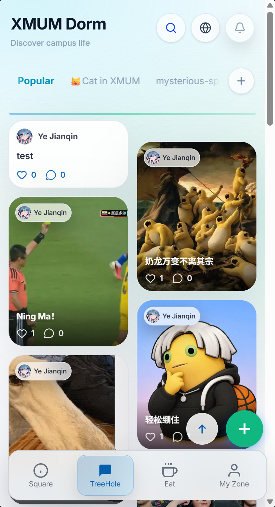

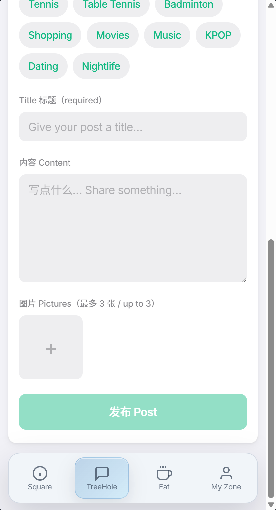

## 七、广场、热搜与校园通知

广场、热搜与校园通知页面集中展示校园通知、轮播信息、热搜讨论和跨模块服务入口。用户可以通过从底部导航进入广场；校园今日页内通过学校通知和学院通知标签切换内容。

学生想快速获取学校或学院通知、参与热搜讨论，或进入社团、二手和跑腿服务时使用。

页面上主要呈现轮播图、校园今日标签、学校通知与学院通知标签、热搜词条、社团、二手和跑腿入口和通知发布按钮等内容，这些内容用于帮助用户确认当前位置和可执行操作。

实际操作时，用户先浏览轮播和校园通知，随后切换学校或学院通知查看对应信息流，接着进入热搜详情参与讨论，最后有组织权限的用户选择所属组织后发布通知。

操作过程中需要注意校园通知发布仅向学校组织、学院或社团负责人开放和普通用户可以浏览公开通知和热搜内容。操作完成后，系统会显示通知发布后进入对应组织信息流和热搜讨论发布后显示在该话题详情中。


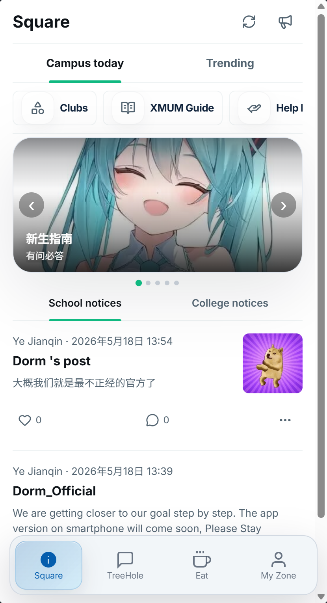

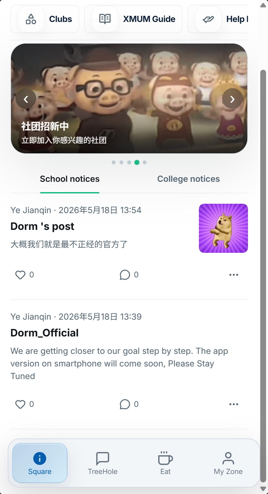

## 八、食堂分区、商铺和菜品

用户可在食堂分区、商铺和菜品页面帮助学生查询食堂分区、商铺、菜品和评价信息，并参与信息共建。用户可以通过从底部导航进入食堂首页，选择食堂分区后进入商铺页，点击商铺或菜品查看详情。

学生在用餐前查询商铺、菜品和排行，或发现缺失信息时补充商铺、菜品和分类。

用户在食堂分区、商铺和菜品页面会看到食堂分区、商铺列表、菜品列表、分类、新增商铺和菜品入口、评价区和排行入口等信息，并可依据页面显示继续处理。

使用该功能时，用户先选择食堂分区浏览商铺，随后进入商铺查看菜品和分类，接着按需要新增商铺、菜品或评价，最后管理员在管理界面处理删除操作。

页面会按照登录用户可以新增商铺、菜品和分类、普通用户不能删除商铺、菜品和分类和评价和上传内容需要满足输入规则等规则限制或提示用户。处理结束后，用户可以看到新增内容成功后出现在相应列表、评价提交后更新菜品评价信息和管理员删除后内容不再公开显示。


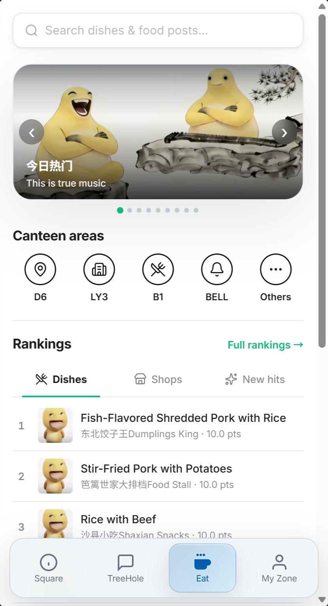

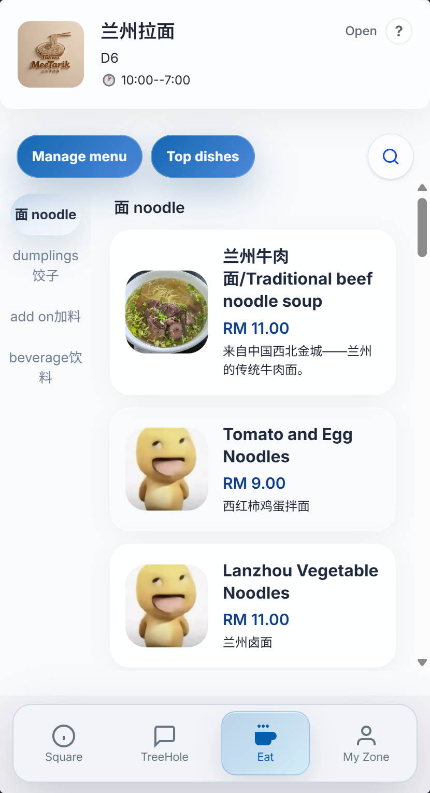

## 九、社团与活动报名

用户可在社团与活动报名页面供学生了解社团、查看社团动态并报名参加活动。用户可以通过从广场或底部导航进入社团首页，选择社团和活动条目进入详情。

学生寻找社团或决定参加活动时使用；社团负责人维护社团日常内容和活动安排。

该部分提供社团列表、社团主页、动态帖子、活动通知、报名按钮、成员入口和发布入口等页面内容，用户可据此查看状态、填写信息或选择下一步操作。

在该页面中，用户先浏览或搜索社团，随后进入社团查看动态和活动，接着符合条件时填写活动报名信息，之后负责人发布活动或日常帖子并查看报名情况，再在活动详情查看时间、地点、人数和报名截止状态，继续点击报名后确认个人信息，报名人数已满或活动关闭时不能提交，最后负责人进入社团管理入口查看报名名单，并可发布或更新活动。

如果不满足活动报名需要登录且受报名状态限制、社团发布入口只对具有社团权限的负责人开放、同一用户不能重复报名同一活动、活动结束或报名截止后报名按钮不可用和负责人只能管理自己有权限的社团等要求，用户需要根据页面提示调整后再继续。页面反馈通常包括报名成功后显示报名状态并生成事务通知、发布成功后社团主页更新相应内容、报名成功后按钮变为已报名并在信箱收到活动通知和报名失败时显示具体原因，负责人发布内容后在社团动态中可见。


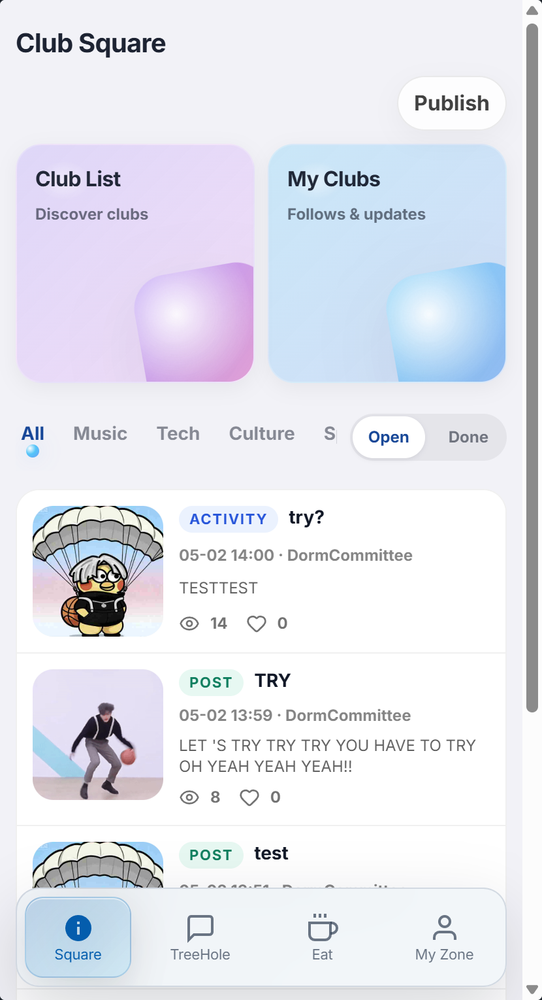

## 十、二手交易与跑腿任务

用户可在二手交易与跑腿任务页面为学生提供校内闲置物品流转和日常跑腿任务协作入口。用户可以通过从广场入口或底部导航进入二手市场和跑腿模块，点击发布按钮创建商品或任务。

学生出售或购买闲置物品、发布临时跑腿需求或承接他人任务时使用。

页面上主要呈现分类标签、商品或任务列表、筛选项、搜索入口、发布按钮、详情页和状态操作等内容，这些内容用于帮助用户确认当前位置和可执行操作。

实际操作时，用户先选择分类或状态筛选内容，随后进入详情查看商品或任务信息，接着发布自己的商品或跑腿需求，之后根据完成情况维护出售或承接状态，再在二手市场按分类、状态或关键词缩小列表范围，继续打开商品详情查看价格、描述和联系方式后发起沟通，最后在跑腿页面查看任务要求，选择承接或维护自己发布的任务状态。

操作过程中需要注意发布需要登录、用户只能维护自己的商品或任务、状态变更受当前任务或商品状态限制、商品标题、描述和价格必须填写且价格为有效数值、已售商品不能再次标记为出售，已完成任务不能再次承接和交易和任务内容只能由发布者维护，状态操作需登录。操作完成后，系统会显示发布成功后显示在列表中、状态更新后列表标签和详情状态同步变化、筛选条件变化后列表立即更新、商品或任务状态变更后详情页和列表显示最新状态和无结果时显示空列表提示。


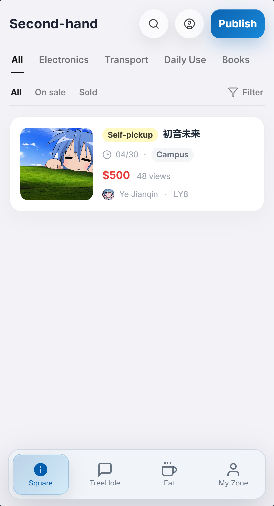

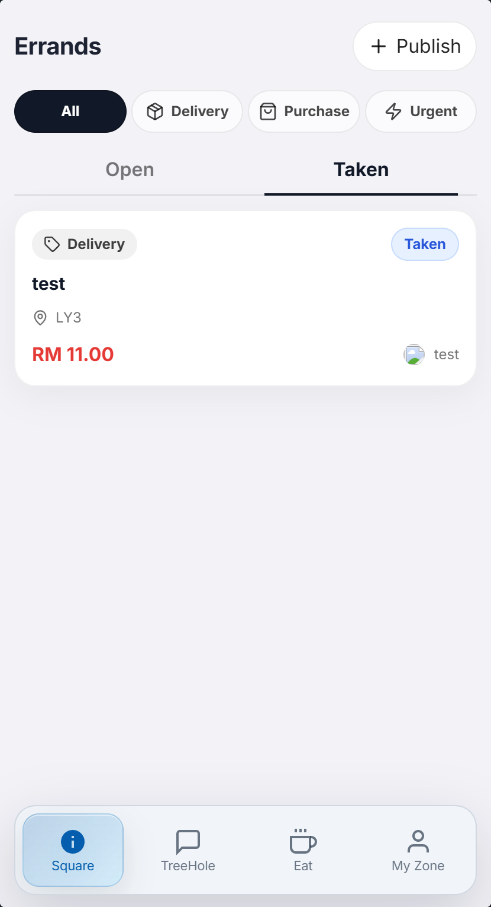

## 十一、课程表、待办与日记

用户可在课程表、待办与日记页面帮助学生记录课程安排、临时事项和个人日记。用户可以通过从个人空间进入课程表、待办或日记页面。

学生需要查看一周课程、安排待办或记录校园生活时使用。

用户在课程表、待办与日记页面会看到课程周视图、待办列表、新增待办按钮、完成勾选项、日记日历和日记编辑区等信息，并可依据页面显示继续处理。

使用该功能时，用户先查看或维护课程安排，随后新增待办并设置截止信息，接着勾选完成的待办，之后选择日期创建或修改日记，再在课程表中选择周次或日期查看当天课程，继续新增待办时填写标题和截止日期，保存后可在列表中勾选完成，最后打开日历中的日期查看已有日记，编辑后保存返回日期视图。

页面会按照个人课程、待办和日记仅对本人可见和维护、待办标题和日期需符合输入限制、课程、待办和日记的内容按当前用户隔离、待办标题不能为空，截止日期格式必须有效和删除或修改日记前需要确认操作等规则限制或提示用户。处理结束后，用户可以看到待办完成状态立即更新并与服务器同步、保存日记后在日历和对应日期中显示记录、课程切换周次后显示对应课程安排、勾选待办后界面先更新完成状态，服务器失败时恢复原状态并提示和日记保存成功后显示在所选日期。


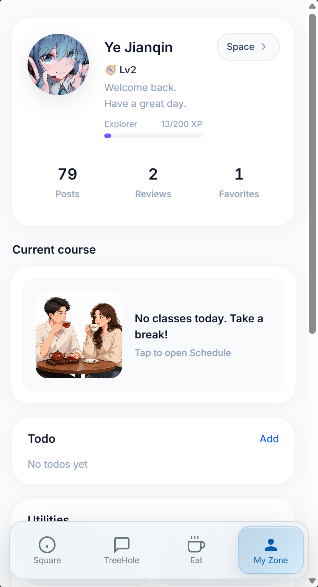

## 十二、站内信箱、举报与后台管理

站内信箱、举报与后台管理页面让用户集中查看互动和事务提醒，并让管理员处理平台治理事项。用户可以通过从顶部通知入口或个人空间进入信箱；在内容详情中打开举报入口；管理员从个人空间进入后台。

学生收到评论、活动或组织事务提醒时查看信箱；发现不当内容时举报；管理员审核内容和用户状态时使用后台。

该部分提供通知分类标签、未读状态、清空入口、举报原因选择、后台数据概览、用户和内容处理操作和审计记录等页面内容，用户可据此查看状态、填写信息或选择下一步操作。

在该页面中，用户先在信箱查看通知并进入关联内容，随后选择原因提交举报，接着管理员查看待处理举报并进行内容或用户处置，最后管理员查看系统配置和审计记录。

如果不满足通知仅向对应用户展示、举报需要登录和后台操作仅向管理员开放并记录处理行为等要求，用户需要根据页面提示调整后再继续。页面反馈通常包括通知阅读后未读数量更新、举报提交后显示提交结果和管理员处置后目标内容或用户状态发生变化。


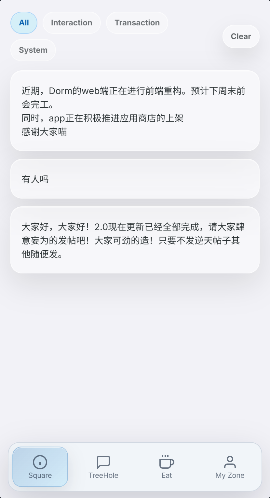

## 十三、典型使用流程

用户完成一次完整业务时，通常先进入厦马小筑，再选择或创建业务对象，随后按照页面提示处理内容并查看结果。

学生注册或登录校园账号，并按需要设置昵称、头像和语言；学生从底部导航进入树洞、食堂、广场、社团或个人空间，浏览与自己相关的内容；学生在对应模块完成发帖、评价、报名、交易发布、任务发布或个人记录维护；系统将评论、活动报名、组织通知等结果写入站内信箱，用户可查看和处理未读通知。

## 十四、常见问题解答

问题：为什么不能发布内容？
解决方法：请确认已经登录，且账号未处于禁言或停用状态；如仍无法发布，可检查提示信息后联系管理员。

问题：如何关闭或清理通知？
解决方法：可在站内信箱按分类查看和清空通知；系统通知权限可在手机系统设置中关闭。

问题：为什么不能删除食堂商铺、菜品或分类？
解决方法：食堂信息允许用户共同补充，但删除操作仅由管理员执行，以避免公共资料被误删。

## 十五、术语表

| 术语 | 解释 |
| --- | --- |
| 树洞 | 用于匿名发布校园讨论内容的社区区域。 |
| 校园通知 | 由学校组织、学院或社团负责人发布的公开信息。 |
| 组织负责人 | 获得对应学校组织、学院或社团内容维护权限的用户。 |
| 站内通知 | 平台内展示的评论、活动和事务提醒。 |

```text
STOP_FOR_USER
NEXT_ACTION: 请一次性确认完整操作手册草稿是否符合真实业务；必要时先统一修改段落内容，再运行 confirm_stage.py --stage markdown。
```
